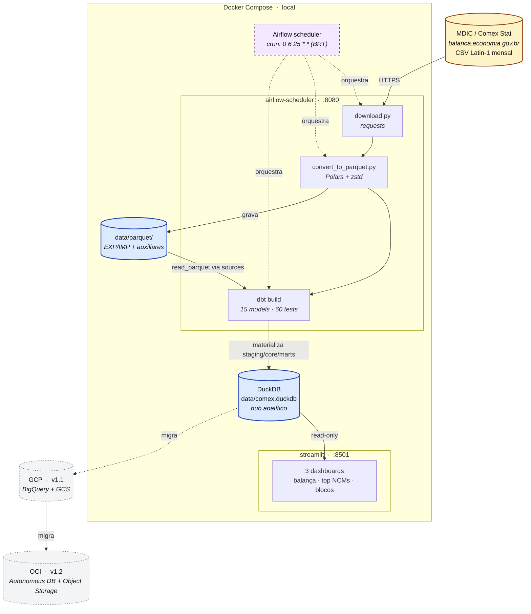

# Comex Brasil — Data Engineering Portfolio

> Pipeline de Data Engineering end-to-end usando dados públicos de comércio exterior brasileiro (MDIC / Comex Stat).

## Status do projeto


## Sobre o projeto

Este projeto constrói um pipeline completo de Data Engineering sobre dados públicos de exportação e importação brasileira, disponibilizados pelo Ministério do Desenvolvimento, Indústria e Comércio (MDIC) via Comex Stat.

O objetivo é demonstrar habilidades práticas de engenharia de dados — desde a ingestão de arquivos brutos até dashboards analíticos — evoluindo de um ambiente local para cloud (GCP e OCI).

## Perguntas de negócio respondidas

- Qual a balança comercial do Brasil por estado nos últimos 5 anos?
- Quais são os 10 principais produtos exportados por valor FOB?
- Como evoluiu a participação da China nas importações brasileiras?
- Como a pandemia (2020) impactou o comércio exterior brasileiro?
- Quais blocos econômicos têm maior peso na pauta exportadora?

## Arquitetura



> **Legenda:** caixas amarelas = fontes externas, azuis = armazenamento de dados, lilás pontilhado = orquestração, cinza pontilhado = migrações futuras (v1.1 / v1.2).

## Stack

| Camada | Ferramenta |
|---|---|
| Containerização | Docker + Docker Compose |
| Ingestão | Python + Polars |
| Engine analítica local | DuckDB |
| Transformação | dbt Core |
| Orquestração | Apache Airflow |
| Visualização | Streamlit |
| Cloud (fase 2) | GCP — BigQuery + Cloud Storage |
| Cloud (fase 3) | OCI — Object Storage + Autonomous DB |

## Volume de dados (5 anos: 2020–2024)

| Direção | Linhas | CSV | Parquet | Compressão |
|---|---|---|---|---|
| Exportação (EXP) | 7.488.174 | 475 MB | 77 MB | 6.2x |
| Importação (IMP) | 10.169.636 | 711 MB | 132 MB | 5.4x |
| Tabelas auxiliares | 21.298 | 11 MB | 1.3 MB | 8.5x |
| **Total** | **~17.7 milhões** | **~1.2 GB** | **~210 MB** | **5.7x** |

Após `dbt run` completo, o arquivo `data/comex.duckdb` fica em **~440 MB** (inclui staging em views e core/marts materializados como tabelas).

## Roadmap

- [x] **v0.1 — Infraestrutura base (Docker + ingestão)**
- [x] **v0.2 — dbt local com DuckDB**
- [x] **v0.3 — Orquestração com Airflow**
- [x] **v0.4 — Visualização (Streamlit)**
- [ ] v1.0 — MVP completo local
- [ ] v1.1 — Migração para GCP (BigQuery)
- [ ] v1.2 — Camada OCI
- [ ] v2.0 — Camada de IA (agentes sobre os dados)

## Fonte de dados

Dados públicos disponíveis em: https://www.gov.br/mdic/pt-br/assuntos/comercio-exterior/estatisticas/base-de-dados-bruta

**Padrão de URL dos arquivos:**
- Exportação: `https://balanca.economia.gov.br/balanca/bd/comexstat-bd/ncm/EXP_{ANO}.csv`
- Importação: `https://balanca.economia.gov.br/balanca/bd/comexstat-bd/ncm/IMP_{ANO}.csv`
- Tabelas auxiliares: `https://balanca.economia.gov.br/balanca/bd/tabelas/{NOME}.csv`

---

## Como executar

### Pré-requisitos

- [Docker Desktop](https://www.docker.com/products/docker-desktop/) instalado e em execução
- Git Bash (Windows) ou terminal bash (Linux/macOS)
- ~3 GB de espaço em disco para dados + DuckDB
- ~4 GB de RAM livres (o Airflow consome 2–4 GB)

### 1. Subir o ambiente

```bash
# Primeira vez: faz o build da imagem customizada e sobe tudo
docker compose up -d --build

# Próximas vezes
docker compose up -d
```

Acesse o Airflow em http://localhost:8080 (usuário `admin` / senha `admin`).

### 2. Orquestração com Airflow (v0.3 — caminho recomendado)

A partir da v0.3 o pipeline inteiro (download → convert → dbt build) roda como
uma DAG do Airflow chamada `comex_pipeline`.

**Importar as Variables do Airflow (uma vez após o primeiro `up`):**

```bash
./scripts/seed_airflow_variables.sh
```

Isso carrega `comex_anos`, `comex_dbt_vars` e `comex_dbt_target` a partir de
`airflow/variables.json`.

**Disparar manualmente pela UI:**

1. Acesse http://localhost:8080 (admin / admin).
2. Destrave (unpause) a DAG `comex_pipeline`.
3. Clique em ▶ *Trigger DAG* — ou em ▶ *Trigger DAG w/ config* para passar
   overrides via JSON.

**Overrides aceitos em `dag_run.conf`:**

| Chave | Tipo | Exemplo | Efeito |
| --- | --- | --- | --- |
| `anos` | list[int] | `{"anos": [2024]}` | Baixa/converte apenas esses anos |
| `dbt_vars` | dict | `{"dbt_vars": {"ano_inicio": 2024, "ano_fim": 2024}}` | Janela do dbt |
| `dbt_target` | str | `{"dbt_target": "duckdb"}` | Target do profiles.yml |
| `force` | bool | `{"force": false}` | Pula download/convert quando arquivo já existe |

**Agendamento:** todo dia 25 às 06:00 (America/Sao_Paulo) — buffer de 10 dias
após a publicação mensal do MDIC (~dia 15).

### 3. Ingestão manual (fluxo antigo, ainda funciona)

**Baixar todos os CSVs do MDIC (EXP + IMP de 2020–2024 + tabelas auxiliares):**

```bash
docker compose exec airflow-scheduler python /opt/airflow/ingestion/download.py
```

**Converter os CSVs para Parquet:**

```bash
docker compose exec airflow-scheduler python /opt/airflow/ingestion/convert_to_parquet.py
```

### 4. Transformações com dbt

```bash
# Testar a conexão com o DuckDB
./scripts/dbt.sh debug

# Rodar todos os models (staging → core → marts)
./scripts/dbt.sh run

# Rodar models + testes (recomendado)
./scripts/dbt.sh build

# Rodar apenas uma camada
./scripts/dbt.sh run --select staging
./scripts/dbt.sh run --select core
./scripts/dbt.sh run --select marts
```

Tempo esperado num `dbt build` completo: **~25 segundos** (17M linhas em DuckDB).

### 5. Gerar e visualizar a documentação dbt

🌐 **Versão hospedada (recomendada para visualizar sem subir o ambiente):**
[`https://gabrielp1nheiro.github.io/data-engineer-comex/`](https://gabrielp1nheiro.github.io/data-engineer-comex/)

A página mostra o lineage completo do pipeline (Parquet → staging → core → marts), descrição de cada coluna e os 60 testes. É publicada automaticamente a cada push em `main` que toca `dbt/**`, via o workflow `.github/workflows/dbt-docs.yml` (usa `dbt docs generate --static --empty-catalog` — sem estatísticas reais; isso volta na v1.1 com BigQuery).

**Geração local (para debug ou ambiente offline):**

```bash
# Gera manifest.json + catalog.json + index.html em dbt/target/
./scripts/dbt-docs.sh generate

# Serve em http://localhost:8081
./scripts/dbt-docs.sh serve
```

A interface mostra o lineage completo do pipeline (Parquet → staging → core → marts), descrição de cada coluna e o status de cada teste.

### 6. Opções da ingestão

```bash
# Download parcial: apenas anos específicos
python ingestion/download.py --anos 2023 2024

# Apenas exportações (sem importações)
python ingestion/download.py --direcao exp

# Sem tabelas auxiliares
python ingestion/download.py --sem-aux

# Forçar re-download
python ingestion/download.py --force
```

Os mesmos argumentos funcionam no `convert_to_parquet.py`.

### 7. Dashboards Streamlit (v0.4)

A partir da v0.4 os marts ficam navegáveis via Streamlit, lendo o DuckDB em
modo **somente leitura** (pode rodar concorrente ao Airflow sem risco).

**Subir o serviço (primeira vez ou após mudar `dashboard/requirements.txt`):**

```bash
docker compose up -d --build streamlit
```

**Subsequentes:**

```bash
docker compose up -d streamlit
```

Acesse em http://localhost:8501. A página inicial mostra o status do
warehouse (linhas em `core_comercio`, cobertura de anos, mtime do arquivo).

**Páginas disponíveis (sidebar do Streamlit):**

| Página | Marts consumidos | Filtros |
| --- | --- | --- |
| 📊 **Balança Comercial** | `mart_balanca_comercial` | UF (multi) + range de anos |
| 🏆 **Top Produtos** | `mart_top_produtos` | Direção (EXP/IMP) + ano + top-N |
| 🌐 **Blocos Econômicos** | `mart_blocos_economicos` | Direção + blocos (multi) |

Cada página oferece KPIs no topo, charts Plotly interativos e tabela
detalhada com download em CSV.

**Hot-reload em dev:** o código de `dashboard/` é montado via bind mount;
salvar um `.py` recarrega o app automaticamente.

**Forward compatibility:** a conexão é encapsulada em `dashboard/lib/db.py`
com a env var `COMEX_DB_TARGET` (default `duckdb`). Na v1.1 (BigQuery) basta
implementar o branch `bigquery` — as queries e charts não mudam.

### 8. Parar o ambiente

```bash
docker compose down          # preserva os dados
docker compose down -v       # apaga volumes (reset completo)
```

---

## Modelos dbt (v0.2)

```
sources (Parquet)
   ├── comex_raw.exportacoes       EXP_{2020..2024}.parquet
   ├── comex_raw.importacoes       IMP_{2020..2024}.parquet
   └── comex_aux.{ncm, ncm_sh, pais, pais_bloco, uf, via, urf}

staging (views)
   ├── stg_exportacoes     — tipagem e janela de anos
   ├── stg_importacoes     — idem + CIF (FOB+frete+seguro)
   ├── stg_ncm             — NCM + hierarquia SH (JOIN com ncm_sh)
   ├── stg_paises          — códigos MDIC + ISO3
   ├── stg_uf              — UFs + regiões
   ├── stg_vias            — modais de transporte
   ├── stg_urf             — Unidades da Receita Federal
   └── stg_blocos          — país x bloco econômico

core (tables)
   ├── core_comercio       — fato unificado exp+imp, flag direcao
   └── core_produtos       — dimensão NCM enriquecida

marts (tables)
   ├── mart_balanca_comercial       — saldo FOB por UF/mês/ano
   ├── mart_exportacoes_por_estado  — ranking + share nacional
   ├── mart_importacoes_por_estado  — ranking + share nacional
   ├── mart_top_produtos            — ranking de NCMs por direção
   └── mart_blocos_economicos       — comércio por bloco (Mercosul, UE, etc)
```

**Testes:** 60 data tests (not_null, unique, accepted_values, relationships) — todos verdes.

## Exemplos de queries

**Top 5 UFs exportadoras em 2024:**
```sql
select sg_uf, sum(vl_fob_usd)/1e9 as exp_bilhoes_usd
from main_marts.mart_exportacoes_por_estado
where ano = 2024
group by 1 order by 2 desc limit 5;
```

Resultado:
| UF | US$ bi |
|---|---|
| SP | 71.4 |
| RJ | 45.8 |
| MG | 42.1 |
| MT | 27.6 |
| PR | 23.3 |

**Balança comercial por ano:**
```sql
select ano,
       sum(vl_exp_fob_usd)/1e9 as exp_bi,
       sum(vl_imp_fob_usd)/1e9 as imp_bi,
       sum(saldo_fob_usd)/1e9  as saldo_bi
from main_marts.mart_balanca_comercial
group by 1 order by 1;
```

Resultado:
| Ano | Exp (bi) | Imp (bi) | Saldo (bi) |
|---|---|---|---|
| 2020 | 209.2 | 158.8 | 50.4 |
| 2021 | 280.8 | 219.4 | 61.4 |
| 2022 | 334.1 | 272.6 | 61.5 |
| 2023 | 339.7 | 240.8 | **98.9** |
| 2024 | 337.0 | 262.9 | 74.2 |

---

## Decisões técnicas e armadilhas conhecidas

### Encoding Latin-1 nos arquivos do MDIC

Os CSVs do MDIC vêm em **Latin-1 (ISO-8859-1)**, não UTF-8. Se lidos como UTF-8, acentos e caracteres especiais viram lixo (`Rond�nia` em vez de `Rondônia`). O script de conversão trata isso explicitamente.

### Códigos com zeros à esquerda

Campos como `CO_MES`, `CO_NCM`, `CO_PAIS`, `CO_URF` têm zeros à esquerda no MDIC (`"04"`, `"00101600"`, `"049"`, `"0817600"`). O converter para Parquet transformou alguns em BIGINT, perdendo esses zeros. A camada staging do dbt aplica `LPAD` explicitamente (`CO_NCM` → 8 dígitos, `CO_PAIS` → 3, `CO_URF` → 7) antes de qualquer join.

### Certificado SSL do gov.br no container

O servidor `balanca.economia.gov.br` usa certificado emitido pela ICP-Brasil, que não está na lista de CAs confiáveis da imagem Docker do Airflow. Como os dados são públicos e o host é um domínio `.gov.br`, o script de download desabilita a verificação SSL via `verify=False`. Essa decisão será revisitada na migração para cloud (v1.1+).

### Permissões de arquivo no Windows

Arquivos criados pelo container (usuário `airflow`, UID 50000) aparecem como "sem permissão" no Explorer do Windows. Clicar em "Continuar" ajusta as permissões uma vez e o aviso não retorna.

### Git Bash e conversão de paths

O Git Bash no Windows converte paths Unix do tipo `/opt/airflow/dbt` para paths Windows antes de passar para o Docker. Para desabilitar:

```bash
echo 'export MSYS_NO_PATHCONV=1' >> ~/.bashrc
source ~/.bashrc
```

### DuckDB como engine local

Usamos DuckDB como data warehouse local em vez de Postgres/MySQL. Motivos:
- **Zero setup** — é um arquivo (`comex.duckdb`) embarcado no contêiner
- **Colunar e paralelo** — agrega 17M linhas em segundos
- **Lê Parquet direto** — dispensa ETL "físico" (os Parquet são a source real)
- **Portável** — mesmo arquivo pode ser aberto via Python, CLI, Tableau, etc.

### Um produto aparece em exp **e** em imp? Sim, é real.

Em 2024 o "óleo bruto de petróleo" (NCM 27090010) aparece no top 1 das exportações **e** das importações. Não é erro do pipeline. O Brasil exporta petróleo pesado (Pré-sal) e importa petróleo leve para refinação. O modelo captura esse fato sem tratamento especial porque a granularidade do MDIC já separa por direção.

---

## Estrutura do projeto

```
comex-brasil-de/
│
├── README.md                        # Este arquivo
├── PROJECT_CONTEXT.md               # Contexto completo (stack, roadmap, decisões)
├── .gitignore
├── docker-compose.yml               # Airflow + Postgres + volume do dbt
├── Dockerfile.airflow               # Imagem customizada (polars, duckdb, dbt-duckdb)
│
├── data/                            # gitignored
│   ├── raw/                         # CSVs originais do MDIC
│   ├── parquet/                     # Arquivos convertidos
│   │   ├── exp/
│   │   ├── imp/
│   │   └── aux/
│   └── comex.duckdb                 # Data warehouse local (~440 MB após dbt build)
│
├── ingestion/
│   ├── download.py
│   ├── convert_to_parquet.py
│   └── requirements.txt
│
├── dbt/
│   ├── dbt_project.yml
│   ├── profiles.yml
│   └── models/
│       ├── staging/   (8 views + sources + tests)
│       ├── core/      (2 tables + tests)
│       └── marts/     (5 tables + tests)
│
├── scripts/
│   ├── dbt.sh                       # Wrapper para comandos dbt
│   ├── dbt-docs.sh                  # Gera e serve a documentação dbt
│   └── seed_airflow_variables.sh    # Importa airflow/variables.json (v0.3)
│
├── airflow/                         # Orquestração (v0.3)
│   ├── dags/
│   │   ├── .airflowignore           # Exclui common/ do scan de DAGs
│   │   ├── comex_pipeline.py        # DAG end-to-end (download→convert→dbt)
│   │   └── common/                  # Helpers importados pelas DAGs
│   │       ├── bash_commands.py     # Builders dos comandos shell
│   │       ├── config.py            # Resolução de Variables/dag_run.conf
│   │       └── paths.py             # Constantes + sink seam (v1.1)
│   ├── plugins/
│   └── variables.json               # Seed das Airflow Variables
│
├── dashboard/                       # Streamlit (v0.4)
│   ├── Dockerfile.streamlit         # Imagem dedicada (~300MB, isolada do Airflow)
│   ├── requirements.txt             # streamlit, duckdb, pandas, plotly
│   ├── streamlit_app.py             # Landing page + status do warehouse
│   ├── .streamlit/config.toml       # Tema (paleta verde/amarelo discreta)
│   ├── lib/
│   │   ├── db.py                    # get_connection() + COMEX_DB_TARGET seam
│   │   ├── queries.py               # Queries cacheadas por mart
│   │   └── charts.py                # Helpers Plotly (paleta, formatadores PT-BR)
│   └── pages/
│       ├── 1_📊_Balanca_Comercial.py
│       ├── 2_🏆_Top_Produtos.py
│       └── 3_🌐_Blocos_Economicos.py
│
└── docs/
    └── images/                      # Screenshots dos dashboards
```

---

*Projeto em desenvolvimento — commits incrementais a cada versão*
